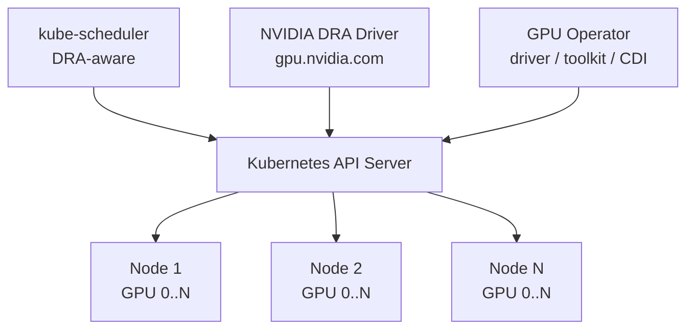
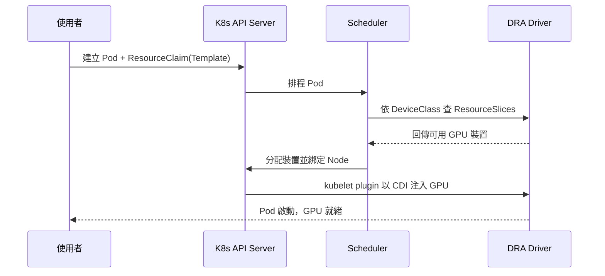

# K8s GPU Platform

RKE2 + DRA (Dynamic Resource Allocation) GPU 叢集的**安裝與維運腳本**，以及 GPU 工作負載範本。
支援任意數量節點、任意 GPU 數量。

應用程式碼與工作負載範本不在本 repo：backend、frontend、device-plugin、cluster-setup 已移除（各自獨立維護）。
本 repo 只有 `scripts/`，不使用 git submodule。

## 目錄結構

```
k8s-gpu-platform/
└── scripts/
    ├── setup/
    │   ├── rke2.sh          # 安裝 RKE2 server / agent 並加入叢集
    │   └── gpu-dra.sh       # 安裝 GPU Operator + NVIDIA DRA driver
    ├── operations/
    │   └── gpu-status.sh    # 一次看完 DRA GPU 狀態
    └── selfcheck.sh         # 腳本自我檢查（不碰主機、不碰叢集）
```

所有 setup 腳本都支援 `DRY_RUN=1`，只印出將執行的指令，先看再跑：

```bash
DRY_RUN=1 sudo scripts/setup/rke2.sh server
DRY_RUN=1 scripts/setup/gpu-dra.sh gpu1 gpu2 gpu3
```

## 架構



GPU 調度流程：



## 前置條件

- N 台 Ubuntu 22.04+ 節點（至少 1 台有 NVIDIA GPU），有 root/SSH
- Kubernetes **≥ 1.34.2**：DRA `resource.k8s.io/v1` 從 1.34 起 GA，NVIDIA DRA driver 0.4.x 要求 1.34.2+
- NVIDIA Driver ≥ 580（由 GPU Operator 安裝，或事先裝在 host 上）
- 執行 `gpu-dra.sh` 的機器需有 `kubectl` 與 `helm`

## Step 1 — 安裝叢集

```bash
# 第一台 control-plane（結束後會印出 join token 與 kubeconfig 路徑）
sudo scripts/setup/rke2.sh server

# 其他 control-plane（HA）
sudo scripts/setup/rke2.sh server <FIRST_NODE_IP> <NODE_TOKEN>

# worker / GPU 節點
sudo scripts/setup/rke2.sh agent <CONTROL_PLANE_IP> <NODE_TOKEN>
```

腳本會：寫 `/etc/rancher/rke2/config.yaml`(0600) → 安裝 RKE2（預設 channel `v1.34`，可用 `RKE2_CHANNEL` 覆寫）
→ 啟用服務 → 在 server 上把 kubeconfig 複製到呼叫者的 `~/.kube/config`。

kubectl 等執行檔在 `/var/lib/rancher/rke2/bin`，記得加進 `PATH`。

## Step 2 — 安裝 GPU + DRA

列出要跑 GPU 的節點（只有這些節點會被貼上 `nvidia.com/dra-kubelet-plugin=true`，DRA kubelet plugin 只在這些節點執行）：

```bash
scripts/setup/gpu-dra.sh gpu1 gpu2 gpu3
```

| 環境變數 | 預設 | 用途 |
|---|---|---|
| `MANAGE_DRIVER` | `true` | `false` = host 已裝 NVIDIA driver，GPU Operator 不接管 |
| `NVIDIA_DRIVER_ROOT` | `/run/nvidia/driver`（host driver 時為 `/`） | driver 根目錄 |
| `GPU_OPERATOR_VERSION` | `v26.3.3` | GPU Operator chart 版本 |
| `DRA_DRIVER_VERSION` | `0.4.1` | `dra-driver-nvidia-gpu` chart 版本 |
| `DRA_NAMESPACE` / `DRA_RELEASE` | `nvidia-dra-driver-gpu` / `dra-driver-nvidia-gpu` | 對齊既有安裝 |
| `NAME_OVERRIDE` | 無 | 從 v25.x 升級時設為 `nvidia-dra-driver-gpu` |

重點：

- 安裝時 `devicePlugin.enabled=false` — DRA 取代 `nvidia.com/gpu` extended resource，兩者不並存
- 已存在 DRA driver 的叢集要用 `DRA_NAMESPACE` / `DRA_RELEASE` 對齊，否則會變成第二份 driver（同一 driver name 兩個 kubelet plugin 會壞掉）。腳本會擋掉 Helm 管理的重複安裝，但**非 Helm 安裝（ArgoCD / kustomize）偵測不到**，請先 `DRY_RUN=1` 確認
- `gpu.nvidia.com`、`mig.nvidia.com` 這些 DeviceClass 由 chart 自動建立，不需自己套用

## Step 3 — 驗證

```bash
scripts/operations/gpu-status.sh
```

會列出：節點與 plugin 標籤、DRA driver pods、DeviceClass、每個節點被廣告的 GPU（ResourceSlices）、GPU 型號、正在使用的 ResourceClaim。

## 使用 GPU 工作負載

`resource.k8s.io/v1` 的請求寫法（`requests[].exactly`，Pod 端直接寫 `resourceClaimTemplateName`，沒有 `source:`）：

```yaml
apiVersion: resource.k8s.io/v1
kind: ResourceClaimTemplate
metadata:
  name: gpu-claim-template
spec:
  spec:
    devices:
      requests:
        - name: gpu
          exactly:
            deviceClassName: gpu.nvidia.com
            count: 1          # 要 4 張就寫 4
---
apiVersion: v1
kind: Pod
metadata:
  name: gpu-workload
spec:
  restartPolicy: Never
  containers:
    - name: cuda
      image: nvidia/cuda:12.9.0-runtime-ubuntu22.04
      command: ["nvidia-smi"]
      resources:
        claims:
          - name: gpu       # 對應下面 resourceClaims 的名稱
  resourceClaims:
    - name: gpu
      resourceClaimTemplateName: gpu-claim-template
```

多個 Pod 共用同一批 GPU：改建 `ResourceClaim`（不是 Template），Pod 用 `resourceClaimName` 引用。

指定 GPU 型號時自建 DeviceClass：

```yaml
apiVersion: resource.k8s.io/v1
kind: DeviceClass
metadata:
  name: rtx5090.gpu.nvidia.com
spec:
  selectors:
    - cel:
        expression: >-
          device.driver == 'gpu.nvidia.com' &&
          device.attributes['gpu.nvidia.com'].type == 'gpu' &&
          device.attributes['gpu.nvidia.com'].productName.contains('5090')
```

> 舊 YAML 若還在寫 `resources.limits."nvidia.com/gpu"`：device plugin 被關掉後這些請求不會被滿足，需改寫成上面的 ResourceClaim 形式（或啟用 `DRAExtendedResource` feature gate 讓 scheduler 自動轉換，K8s 1.36+ 預設開啟）。

## 開發／修改腳本

```bash
scripts/selfcheck.sh   # 語法 + 參數分派 + driver root 分支，不需叢集
```

## 與舊架構差異

| | 舊版 | 現在 |
|---|---|---|
| 程式碼管理 | 4 個 submodule | 本 repo 只留 scripts |
| K8s 安裝 | kubeadm 手動 | `scripts/setup/rke2.sh` |
| GPU 調度 | 自訂 Device Plugin + MPS | K8s DRA（原生 `resource.k8s.io/v1`） |
| GPU 資源定義 | `nvidia.com/gpu` 整數計數 | ResourceClaim + DeviceClass（CEL 選擇器） |
| 節點數量 | 固定 4x RTX 5090 / node | 任意節點、任意 GPU 數量 |

## FAQ

**如何確認 GPU 被 DRA 正確識別？** `scripts/operations/gpu-status.sh`，或 `kubectl get resourceslices -o yaml | grep productName`。

**如何新增節點？** 在新節點跑 `sudo scripts/setup/rke2.sh agent <IP> <TOKEN>`，再重跑 `scripts/setup/gpu-dra.sh <新節點>`（Helm 是 upgrade，可重複執行）。

**如何限制使用者只能用特定 GPU？** 自建型號專屬 DeviceClass，再用 Kyverno 限制 namespace 可引用的 DeviceClass。

**Pod 卡在 Pending 且錯誤是 `must specify one of: resourceClaimName, resourceClaimTemplateName`？** `spec.resourceClaims` 每一項只能設其中一個；若寫法正確，通常是叢集裡有 K8s < 1.32 建的 mutating webhook 把欄位改掉了。

---

**Last Updated**: 2026-08-18
